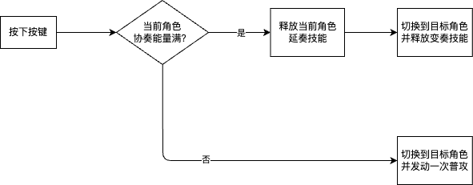

# 鸣潮战斗拆解

## 战斗系统简介

鸣潮的战斗体系为队伍战斗，切人的时候根据队伍情况会触发特殊效果

## 战斗系统要素

### 伤害

鸣潮伤害来源为以下几个乘区和粗略来源
1. 基础数值：角色等级、武器等级、声骸、技能、共鸣链
2. 倍率：技能等级、共鸣链
3. 伤害加成：声骸、技能
   1. 属性伤害加成
   2. 对应技能伤害加成
4. 伤害加深：技能
5. 暴击：声骸、共鸣链

可以看到声骸和共鸣链对伤害的影响较多，是游戏中占比比较大的养成要素

声骸以及其他养成手段主要通过体力刷取，共鸣链必须通过抽卡以及抽卡副产品换取，前者引导玩家消耗体力，来让玩家保证每日上线；后者则通过卡池轮换与卡池概率来引导玩家充值

### 能量

能量分为协奏能量和共鸣能量

#### 协奏能量

协奏能量通过以下手段获得：
1. 释放技能
2. 释放声骸
3. 普攻

当在场角色协奏能量满时，切人可以触发退场角色的延奏技能和入场角色的变奏技能

#### 共鸣能量

共鸣能量为角色造成伤害获得，获取数值公式为：

1. 前场角色：造成伤害\*系数\*能量获取效率\*100%
2. 后场角色：造成伤害\*系数\*能量获取效率\*50%

每个角色能量上限不同，当能量达到上限时，角色可以释放共鸣解放技能

## 队伍机制

### 离场残留

当在场角色正在进行动作时（技能动画期间）执行切人操作，在新角色入场后，前一个角色仍然会在场上将动作执行完，随后再离场。
在这个期间，该角色视为在场，会享受100%的共鸣能量获取效率

因此引出了鸣潮的合轴理论：在角色释放动画较长的技能时，可以切人来规避技能前后摇，从而在输出总量不变的前提下，压缩输出时间，并且获得更多的共鸣能量，从而优化循环